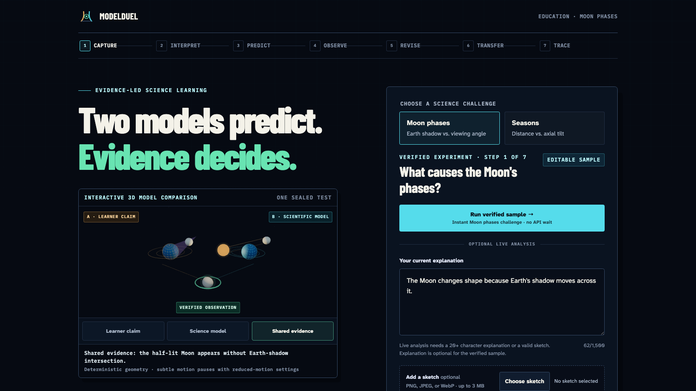

# ModelDuel

**Two models predict. Evidence decides.**

ModelDuel is an Education-category learning experience that turns a learner's explanation into two comparable worlds: the learner's current mental model and the scientific model. The learner commits to a prediction, observes both worlds under the same conditions, revises the explanation, and answers one transfer item. The result is a reviewable trace of a conceptual revision attempt and one transfer result—not proof of durable conceptual change.

The two complete challenges focus on common astronomy misconceptions: that Earth's shadow causes the phases of the Moon, and that Earth-Sun distance causes the seasons. Both use the same protected learning sequence and deterministic solar-system foundation.



## Submission links

- Live demo: [modelduel.yasei.workers.dev](https://modelduel.yasei.workers.dev)
- Repository: [github.com/Yasei-no-otoko/ModelDuel](https://github.com/Yasei-no-otoko/ModelDuel)
- Demo video: `{{VIDEO_URL}}`
- Codex Feedback Session ID: `019f648c-0eb8-7b60-ad84-28ce35bbac4b`

Replace the remaining video placeholder before submission. The public MIT-licensed repository is judge-accessible, and the primary build task was uploaded through Codex's official feedback workflow.

## Current scope

The repository implements complete Moon-phases and seasons browser journeys: text or sketch capture, explicit live or verified analysis, two protected models, prediction locking, deterministic simulation with Three.js rendering, revision feedback, server-authenticated transfer grading, and a Model Revision Trace. The trace ends with a compact same-session teacher review and a learner-controlled clipboard copy or local text download. The handoff makes no API call and creates no account, share link, or server-side record; the active page, system clipboard, browser, or device may still retain a copy. The editable text is a conversation aid, not a signed or teacher-authenticated record. The production configuration routes analysis and PTC to GPT-5.6 Terra and live revision feedback to GPT-5.6 Luna. Each scenario has strict server-owned cases, world specifications, transfer questions, and authored verified samples.

Live and verified paths are deliberately separate for both scenarios. Live analysis accepts learner text, a sketch, or both. The verified path is explicitly selected and may start from an empty capture; a failed live request never becomes an authored result automatically. The UI labels the source of analysis and revision feedback. The public transfer token keeps the answer key and live revision context encrypted on the server boundary.

## Judge quick test

### Verified sample — no account or key

1. Open ModelDuel and select **Run verified sample**.
2. Select **Make a prediction**.
3. Choose one option, then select **Lock prediction**.
4. Select **Run both worlds and reveal evidence**.
5. Select **Revise my explanation** and enter this full-scoring Moon revision exactly:

   > The Moon's phases change because sunlight illuminates half of the Moon while its orbit changes our viewing angle, so we see different fractions of the sunlit half. Earth's shadow does not cause the regular phases; it causes a lunar eclipse.

6. Select **Capture revision and continue**.
7. For the Moon transfer question, choose **The Moon is in the Sun's direction**, then select **Lock and check answer**.
8. Inspect the Model Revision Trace from initial belief through transfer result. Review the local teacher-handoff preview; copying or downloading it requires the learner-text confirmation and sends no additional request.
9. Select **New attempt**, choose **Seasons**, and repeat the verified journey. For the Seasons transfer question, choose **The higher-energy hemisphere reverses** before selecting **Lock and check answer**.

### Configured live path

Live analysis requires a server-side `OPENAI_API_KEY`. Enter at least 20 characters of learner text, attach a PNG, JPEG, or WebP sketch up to 3 MiB decoded, or provide both, then deliberately choose the live path. A failed live request remains a disclosed error and never silently falls back to an authored sample. After every local, dry-run, deployed-binding, header, and free-ledger gate passed, final production merge `e5e7b03` completed one Terra analysis/PTC request and one same-session Luna revision request with zero HTTP or SDK retries; no further paid canary was run.

## Requirements

- Node.js `>=22.13.0`; [`.nvmrc`](.nvmrc) pins `24.18.0`.
- pnpm `11.13.0` through `packageManager`; supported engine range `>=11.13 <12`.
- No account or API key for verified samples.
- `OPENAI_API_KEY` only for optional live analysis and revision flows.

## Local setup

Install and start the verified experience first:

```bash
pnpm install --frozen-lockfile
pnpm dev
```

Open the local URL printed by Next.js. For optional live flows, stop the server, copy the environment template, add the server-side key, and restart:

```bash
cp .env.example .env.local
```

Do not commit `.env.local` or expose its values in screenshots, videos, logs, or browser code.

## Environment

| Variable | Required | Purpose and fallback |
| --- | --- | --- |
| `OPENAI_API_KEY` | Live flows only | Server-side key for live analysis and live revision. Verified samples require no key. Missing or blank live configuration fails closed. |
| `OPENAI_MODEL` | Optional | Revision fallback; defaults to `gpt-5.6-luna`. |
| `OPENAI_HERO_MODEL` | Optional | Analysis fallback; defaults to `gpt-5.6-terra`. |
| `MODELDUEL_ANALYSIS_MODEL` | Optional | First analysis override. Exact chain: `MODELDUEL_ANALYSIS_MODEL` → `OPENAI_HERO_MODEL` → `gpt-5.6-terra`. |
| `MODELDUEL_REVISION_MODEL` | Optional | First revision override. Exact chain: `MODELDUEL_REVISION_MODEL` → `OPENAI_MODEL` → `gpt-5.6-luna`. |
| `MODELDUEL_EVALUATION_SECRET` | Production | Private AES evaluation-token secret. It is required in production and must be at least 32 characters; development alone may generate an ephemeral secret. |
| `MODELDUEL_TRUSTED_PROXY` | Optional | Only `cloudflare` is accepted and requires origin restriction. Vercel is detected internally with `VERCEL=1`; otherwise forwarded headers are ignored. |
| `MODELDUEL_CLOUDFLARE_RATE_LIMITS` | Cloudflare production | `wrangler.jsonc` sets `enabled`; leave blank under `next dev`. Production fails closed if any required Rate Limiting binding is absent or unavailable. |
| `MODELDUEL_REVISION_REPLAY` | Cloudflare production | `wrangler.jsonc` sets `durable-object`; production fails closed if its per-signed-token Durable Object binding is absent or unavailable. Leave blank under `next dev` to use the process-local ephemeral coordinator. |

All learner-data Responses requests use `store: false`. Live analysis and revision budgets are charged only after validation, configuration, and signed-context preflight. To prevent a signed live-revision capability from being charged twice, the token's random `jti` selects a unique Cloudflare Durable Object through an HMAC-derived name. That object temporarily retains an HMAC-derived fingerprint, execution state, and normalized feedback/model result. It never stores the raw token, raw `jti`, session/request IDs, or revised explanation. Cleanup is scheduled after the authorization window plus a one-minute grace. If storage deletion fails, the alarm attempts to re-arm itself once per minute; a failed re-arm throws so Cloudflare's finite alarm retries can run. Normalized feedback may still reflect the learner's explanation until cleanup succeeds. Local development uses a process-local coordinator with timed eviction; tests may inject isolated coordinators explicitly. Cloudflare production is configured with fail-closed Rate Limiting bindings that check the hashed client before the per-POP aggregate ceiling.

## Commands

| Command | Purpose |
| --- | --- |
| `pnpm dev` | Start the development server. |
| `pnpm build` | Create a production build. |
| `pnpm start` | Run the production build. |
| `pnpm lint` | Run lint checks. |
| `pnpm typecheck` | Run TypeScript checks. |
| `pnpm test` | Run unit and integration tests. |
| `pnpm test:workers` | Run the SQLite Durable Object concurrency and lifecycle suite in local `workerd`. |
| `pnpm test:watch` | Run tests in watch mode. |
| `pnpm test:e2e` | Run Playwright journeys in Chromium, Firefox, and WebKit. |
| `pnpm test:e2e:chromium` | Run the Chromium project only for a quick local check. |
| `pnpm video:validate:contracts` | Validate the approved 10-row timeline, selector inventory, production origin, and exact API ledger without external tools or network access. |
| `pnpm video:submission -- --validate-only` | Validate the full local FFmpeg, FFprobe, Chromium, subtitle, and codec toolchain without recording or API calls. |
| `pnpm check` | Run lint, typecheck, Node and `workerd` Vitest suites, portable video-contract validation, and the production build. |
| `pnpm cf:typegen` | Build the OpenNext entrypoint, then regenerate checked-in Workers binding and runtime types. |
| `pnpm cf:typecheck` | Rebuild the OpenNext entrypoint and verify checked-in Workers types have no drift. |
| `pnpm cf:build` | Build the OpenNext Worker and normalize its deterministic client-middleware asset for Cloudflare upload. |
| `pnpm cf:preview` | Build and run locally in the Workers `workerd` runtime. |
| `pnpm cf:upload` | Build and upload an undeployed Worker version. This is a remote mutation and requires release authorization; it is not a dry-run preflight. |
| `pnpm cf:deploy` | Build and deploy the production Worker. |

Cloudflare deployment requires both server secrets already configured for the Worker. Never place them in `vars` or command-line history. Before deployment, run the normal checks, `pnpm cf:typegen`, `pnpm cf:typecheck`, and `wrangler deploy --dry-run`; both type commands rebuild the OpenNext entrypoint before asking Wrangler to generate or compare types. Every `cf:*` build path also applies the fail-closed, idempotent `_clientMiddlewareManifest.js` normalization documented in the Cloudflare deployment reference; bypassing `pnpm cf:build` can reproduce the rejected static-asset hash. `cf:upload` and `cf:deploy` both mutate remote Cloudflare state and require release authorization. Verify the compressed Worker is below the account-plan-specific limit. The production endpoint is [modelduel.yasei.workers.dev](https://modelduel.yasei.workers.dev); dated integration evidence and the final main deployment/canary are recorded below without secrets, cookie values, or learner data.

### Reproducible submission video

The generator reads the exact 10-row narration table from [`docs/DEVPOST_SUBMISSION.md`](docs/DEVPOST_SUBMISSION.md), records only the production verified-sample path, and publishes an immutable MP4/SRT/contact-sheet/manifest bundle under `~/.gstack/projects/DevPostOpenAI/submission/runs/`. It refuses an in-repository output root, blocks service workers and external HTTP, rejects live analysis, and requires the exact `GET /api/demo` → verified `POST /api/revision` → `POST /api/transfer` ledger.

Narration uses OpenAI `tts-1` with the `nova` voice and displays **AI-generated narration · OpenAI TTS** throughout the video. The first approved generation is cost-gated:

Load `OPENAI_API_KEY` through the parent process environment or a secure secret manager before the first run; never place the key itself in the command line or shell history. The recorder strips API keys, tokens, passwords, cookies, and secrets from FFmpeg, FFprobe, Git, and Chromium child environments.

```bash
MODELDUEL_ALLOW_PAID_TTS=1 pnpm video:submission
```

Only the public, approved narration rows are sent to the Speech API. Generated WAV sources are cached by model, voice, and narration hash inside the managed external output root; a per-row exclusive lock prevents concurrent cache misses from issuing duplicate paid requests. After the cache exists, run `pnpm video:submission` without the opt-in variable. Full recording refuses a dirty worktree and snapshots its commit and source hashes before paid or network work. Do not publish any earlier local draft narrated with a macOS System Voice; current Apple licensing limits System Voice projects to personal, non-commercial use and excludes public sharing.

## Architecture

```text
Browser learning flow
→ Validated Next.js server routes
→ OpenAI Responses API (image + text understanding; structured learner model; validated tool orchestration)
→ Allow-listed WorldSpec
→ Deterministic simulation and Three.js comparison rendering
→ Revision trace and transfer result
```

OpenAI does not generate or execute arbitrary Three.js code. It produces schema-constrained data; application code validates that data again and renders only allow-listed bodies, relationships, cameras, and scenarios.

The server routes are:

- `POST /api/analyze` for configured live analysis.
- `GET` or `POST /api/demo` for the explicit authored verified path.
- `POST /api/revision` for `live` or `verified-sample` revision mode.
- `POST /api/transfer` for deterministic server grading.

### Documentation

- [Devpost submission working document](docs/DEVPOST_SUBMISSION.md)
- [OpenAI SDK integration reference](docs/OPENAI_SDK_REFERENCE.md)
- [Cloudflare Workers deployment reference](docs/CLOUDFLARE_DEPLOYMENT_REFERENCE.md)
- [Submission media, narration rights, browser, and accessibility reference](docs/SUBMISSION_MEDIA_REFERENCE.md)
- [Current local Evidence Lens submission-video evidence](docs/VIDEO_EVIDENCE_2026-07-19.md)
- [Historical narration and media QA evidence](docs/VIDEO_EVIDENCE_2026-07-17.md)
- [Product specification](docs/PRODUCT_SPEC.md)

### Authored samples

Authored samples are an explicit, visibly labeled verified path. No cached or authored result is presented as live. A live failure is disclosed without fixture fallback.

### Trust boundary

GPT extracts learner claims and revision prose, but it does not select simulation constants, author a WorldSpec, run arbitrary browser code, choose a transfer answer, or grade the learner. A private server registry validates worlds, reruns deterministic simulations, compares causal prediction codes, selects the discriminating case, and mints an opaque evaluation token from the private answer bank. A schema-valid unsupported or cross-scenario claim stops after extraction and before tool orchestration, does not auto-retry, and exposes only an explicit API-free verified-sample path.

The evaluation token is AES-256-GCM encrypted and authenticated. It binds the session, question, options, answer, rationale, expiry, and live revision context. With `VERCEL=1`, the server trusts only `x-vercel-forwarded-for`. Cloudflare mode trusts only `CF-Connecting-IP` and requires origin restriction. Otherwise, forwarded headers are ignored and requests use the unknown-client bucket.

## How Codex was used

Codex performed these implementation roles under human direction:

- Translated the concept into the capture → interpret → predict → observe → revise → transfer → trace sequence.
- Scaffolded the Next.js and TypeScript application, schemas, API routes, domain layer, and deterministic Three.js scenes.
- Iterated on Responses integration, Programmatic Tool Calling, encrypted evaluation tokens, bounded live requests, and fail-closed behavior.
- Found and addressed tests, stale-response races, accessibility issues, responsive breakpoints, and design-review findings.
- Kept implementation, review fixes, tests, and documentation in scoped commits.

Human-owned decisions include the Education category, target learners and misconceptions, pedagogical sequence, Moon and Seasons scope, privacy stance, trust boundary, experience priorities, and final release acceptance. GPT-5.6 Terra is configured for strict learner-model analysis and PTC, and GPT-5.6 Luna is configured for bounded revision feedback. The deterministic application owns cases, WorldSpecs, simulation, evidence, transfer keys, and grading. Learner-data Responses calls use `store: false`.

The dated 2026-07-17 production integration smoke proved the live Terra analysis/PTC and Luna revision routes for that deployed integration baseline; it is not final-build proof. Codex Feedback Session ID: `019f648c-0eb8-7b60-ad84-28ce35bbac4b`, returned by the official feedback upload for the primary build task.

## Build Week provenance

This repository was initialized from an empty root during the build week. The entries below are representative commits from this repository and do not make a broader rewrite or prior-asset claim.

| Commit | Timestamp | Evidence |
| --- | --- | --- |
| `8f1886b` | 2026-07-15 16:02 JST | Empty repository initialization. |
| `e26700a` | 2026-07-15 16:13 JST | Official SDK integration contract. |
| `543b71d` | 2026-07-15 19:56 JST | Verified Moon flow and state machine. |
| `f8b5b51` | 2026-07-15 21:12 JST | Secure configured live analysis and revision boundary. |
| `0a31dd8` | 2026-07-15 22:18 JST | Complete Seasons challenge. |
| `a945e33` | 2026-07-15 23:05 JST | FINDING-001: revision status and trace. |
| `b9bd4f6` | 2026-07-15 23:15 JST | FINDING-002: learner-facing scenario copy. |
| `b944cab` | 2026-07-15 23:23 JST | FINDING-003: mobile entry and progress. |
| `05ac1bb` | 2026-07-15 23:35 JST | FINDING-004: mobile Seasons comparison. |
| `e480554` | 2026-07-15 23:50 JST | FINDING-005: caption legibility and contrast. |
| `3c987e2` | 2026-07-16 00:07 JST | FINDING-006: accessible sketch upload. |

## Media and licensing

The runtime ships no third-party image, audio, video, or 3D media. The animated Capture hero, astronomy worlds, and verified observations are rendered from deterministic application geometry with no remote models, textures, or runtime generation call. Every Canvas has a semantic no-WebGL fallback. Package dependencies are declared in the repository, and the source is MIT-licensed. The five first-party captures below were refreshed from Cloudflare version `cd38e435-7875-4125-bfbb-c7f5a4d092d0` after the first-view visualizer release.

| Production media | Dimensions | Size | Submission role |
| --- | ---: | ---: | --- |
| [`docs/media/modelduel-cover.png`](docs/media/modelduel-cover.png) | 1600×900 | 152,499 B | Devpost cover and animated 3D landing hero |
| [`docs/media/moon-evidence.png`](docs/media/moon-evidence.png) | 1280×900 | 114,198 B | Moon two-world evidence |
| [`docs/media/model-revision-trace.png`](docs/media/model-revision-trace.png) | 1280×900 | 230,353 B | Completed revision trace and transfer result |
| [`docs/media/seasons-evidence.png`](docs/media/seasons-evidence.png) | 1280×900 | 127,349 B | Seasons two-world evidence |
| [`docs/media/mobile-hero.png`](docs/media/mobile-hero.png) | 375×812 | 63,196 B | Responsive landing, verified CTA, and 3D entry |

Production visual QA completed the Moon journey through trace at 1280px and 375px, and the Seasons journey through evidence at 1280px. Each evidence view rendered two canvases with no 2D recovery view. Horizontal overflow, page errors, failed requests, and unexpected console messages were all zero. The capture used no login and made zero analyze calls: the verified CTA remained primary, revision remained authored, authored-source labels stayed visible, and live analysis stayed disabled before confirmation. The screenshot and cover rights audit is complete. The publishable video must use the disclosed OpenAI TTS narration path above; local macOS System Voice drafts are not cleared for public sharing. Any future music or additional media requires a separate rights review.

## Historical integration verification and final gates

The dated rows below preserve the 2026-07-17 integration baseline and intermediate releases. The current first-view 3D runtime merge `96b93d4` is deployed as Cloudflare version `cd38e435-7875-4125-bfbb-c7f5a4d092d0`.

| Verification | Result |
| --- | --- |
| 2026-07-17 integration baseline | Lint, typecheck, tests, builds, dry run, local workerd, dependency audit, and secret scan passed for that dated commit. Historical counts are intentionally not presented as current. |
| 2026-07-17 production public smoke | Root HEAD and Moon verified demo returned HTTP 200 for the dated integration deployment. |
| 2026-07-17 production integration smoke — Terra | HTTP 200, exact four-tool ledger in five PTC rounds, 7,581 total tokens, estimated **$0.013358**. |
| 2026-07-17 production integration smoke — Luna | HTTP 200, 493 total tokens, estimated **$0.001083**. |
| 2026-07-17 pre-merge quality-branch gate — HEAD `682c206` | Vitest **332/332** across **31 files**; Chromium E2E **34/34**; Next.js, OpenNext, Wrangler, and dependency audit **Pass**; **no known vulnerabilities**. |
| Worker and asset evidence — HEAD `682c206` | Worker **8,277.49 KiB raw / 1,619.89 KiB gzip**; Wrangler **18 deployable asset entries**; **14 physical assets**; largest dynamic 3D chunk **896,059 bytes**. |
| Rendered design evidence — HEAD `682c206` | **B+ / 3.37**, AI Slop **B-**, goodwill **93**, Critical/High/Medium findings **0/0/0**. |
| Entry-path performance evidence | Pre-recovery encoded initial JS **229,931 bytes**; final recovery build at HEAD `682c206` **231,708 bytes**; under 4× CPU throttling, the primary CTA became ready in **363 ms** during the performance audit. |
| Earlier post-merge `main` gate — merge `e04443f` | Vitest **332/332** across **31 files**; Chromium E2E **34/34**; Next.js, OpenNext, `cf:typecheck`, and Wrangler **Pass**; Wrangler dry run **8,277.49 KiB raw / 1,619.88 KiB gzip**; dependency audit **clean**. |
| Historical teacher-handoff `main` gate — merge `6186358` | Vitest **335/335** across **32 files**; Chromium plus WebKit **69 passed / 1 intentional non-Chromium axe skip**; Chromium axe **Pass**; Next.js, OpenNext, `cf:typecheck`, and Wrangler **Pass**; Wrangler dry run **8,286.05 KiB raw / 1,621.89 KiB gzip**; production dependency audit **clean**. |
| Option 2 replay-hardening release gate — main merge `3d65845` | Per-`jti` SQLite Durable Object replay coordination; Codex Security 25-file delta scan **0 reportable findings**, followed by independent alarm-failure review and rollback hardening; Node **344/344**, workerd **7/7**, Chromium **36/36**; Next.js/OpenNext/Workers types/Wrangler **Pass**; Wrangler dry run **8,849.96 KiB raw / 1,704.45 KiB gzip**; production dependency audit **clean**. |
| Historical deployment and public canary — merge `6186358` | Cloudflare version `e400d0d7-3fb1-47be-8872-ef9caeefb5d9`, build ID `nkFYXp8co99asrn8bVd1U`. Root and security headers passed; the exact free three-request verified ledger returned HTTP 200 throughout; the teacher summary/handoff and pre-confirmation disabled state were visible; internal metadata, failed requests, and console errors were absent at [modelduel.yasei.workers.dev](https://modelduel.yasei.workers.dev). |
| Current Option 2 deployment — merge `3d65845` | Cloudflare version `cc6bc7c5-13e6-463d-a8d6-533267a2d468`; `RevisionReplayLedger` was created and all Terra/Luna, Rate Limit, and Durable Object bindings were present. Root HEAD, HSTS/CSP/nosniff, and the exact free `GET /api/demo` → verified `POST /api/revision` → `POST /api/transfer` ledger returned HTTP 200 with zero failed browser requests. No paid model call was made. |
| Final merged release gate — `e5e7b03` | Frozen install; Node **356/356** across **34 files**; workerd **7/7**; Chromium **38/38**; WebKit **37 passed / 1 intentional non-Chromium axe skip**; Next.js/OpenNext/Workers types/Wrangler **Pass**; dry run **8,855.59 KiB raw / 1,705.90 KiB gzip**; production dependency audit **clean**; standard Codex Security scan **96/96 sources**, **0 reportable findings**. |
| Final production deployment — `e5e7b03` | Cloudflare version `37596678-0018-4415-b9bd-5671d67068bb` at 100% traffic; both required secrets, `RevisionReplayLedger`, all four Rate Limit bindings, Terra/Luna routing, HSTS/CSP/nosniff, latest scope copy, and the exact free three-request ledger verified. One final Terra analysis and one same-session Luna revision then returned HTTP 200 with zero retries. |
| Evidence Lens quality gate — `1649c4b` | Node **360/360** across **36 files**; workerd **7/7**; Chromium **38/38**; Next.js/OpenNext/Workers types/Wrangler **Pass**; dry run **8,852.91 KiB raw / 1,707.73 KiB gzip**. The capture, evidence, and trace accessibility gate passed. |
| Current Evidence Lens production — `1649c4b` | Cloudflare version `857b32b6-7ae0-4eec-8be2-75421eaf77ba`; startup **47 ms**; root HTTP 200 with HSTS and CSP; free verified Moon demo HTTP 200; production media capture made **zero** `/api/analyze` calls. |
| First-view 3D release gate — `96b93d4` | Node **363/363** across **37 files**; workerd **7/7**; local Chromium plus WebKit **85 passed / 1 intentional skip**; Ubuntu Chromium/Firefox/WebKit [CI](https://github.com/Yasei-no-otoko/ModelDuel/actions/runs/29681260428) **127 passed / 2 intentional skips**; Next.js/OpenNext/Workers types/Wrangler **Pass**. |
| Current first-view 3D production — `96b93d4` | Cloudflare version `cd38e435-7875-4125-bfbb-c7f5a4d092d0`; startup **45 ms**; 1600×900, 1280×720, and 768×1024 production probes show one running hero Canvas with no errors or horizontal overflow; the exact free three-request ledger passed with zero paid calls. |

The dated production integration sequence made one Terra HTTP request and one Luna HTTP request with zero HTTP retries. Combined telemetry was 8,074 total tokens and an estimated **$0.014441**; the configured dollar ceilings remain output-only bounds, not an all-in preflight guarantee. That remains historical integration evidence, not final-build cost evidence.

After earlier main merge `e04443f`, the paid runtime canary made exactly one live analysis request and one live revision request with zero retries. Analysis returned HTTP 200 in **17.642 seconds**, source `live`, model `gpt-5.6-terra`, with the exact tool order `validate_world_spec` → `simulate_world` → `compare_predictions` → `select_discriminating_case`. Revision returned HTTP 200 in **1.404 seconds**, source `gpt-5.6`, model `gpt-5.6-luna`; the same session and signed evaluation were accepted, conceptual change was `revised` with score `1`, and `liveUseAttestation: true` was carried by both requests. The server-minted cookie was reused with `Path=/`, `HttpOnly`, `Secure`, and `SameSite=Strict`; its value was not recorded. The strict responses did not expose token usage or cost, so neither is guessed. This is inherited integration evidence, not a paid canary of merge `6186358`; the handoff release intentionally used only the free verified path.

The current exact 165-second Evidence Lens video candidate is run `20260719T092408557Z-fec2df68-b1ea-4ea6-9b0a-fb97131df4b5` from generator commit `96b93d4` against the same production merge. It opens on the animated 3D comparison, includes the supported-pilot boundary and learner-controlled teacher handoff, records 363/7/43 and Security 96/96/0 evidence, and uses 10/10 cached narration segments with zero Speech API calls. See [the current video evidence](docs/VIDEO_EVIDENCE_2026-07-19.md). Public video upload and visibility are user-owned manual actions that Codex does not perform. Repository access, the `/feedback` Session ID, and the Ubuntu three-engine CI gate are verified. The public video placeholder, logged-out video/link check, and final Devpost form submission remain user-owned gates. Track the canonical handoff in [docs/DEVPOST_SUBMISSION.md](docs/DEVPOST_SUBMISSION.md).

## License

[MIT](LICENSE)
